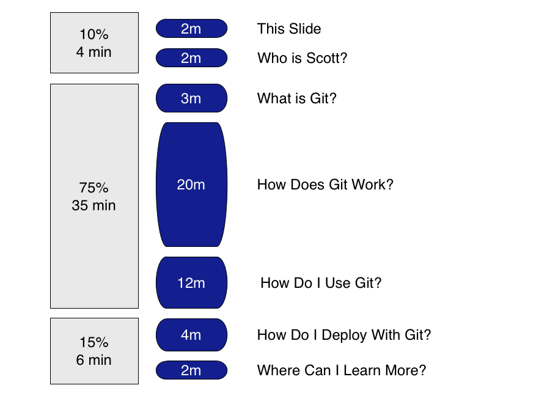
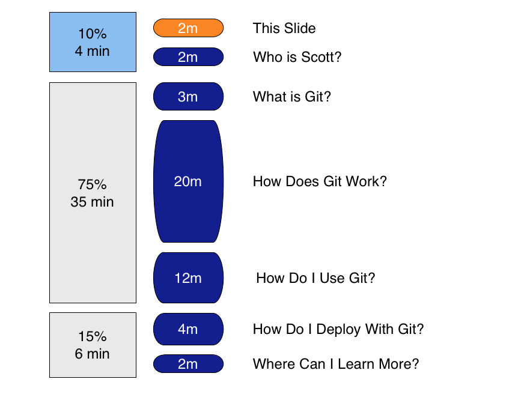
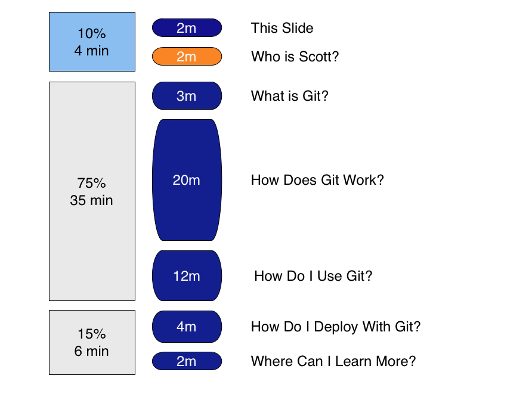
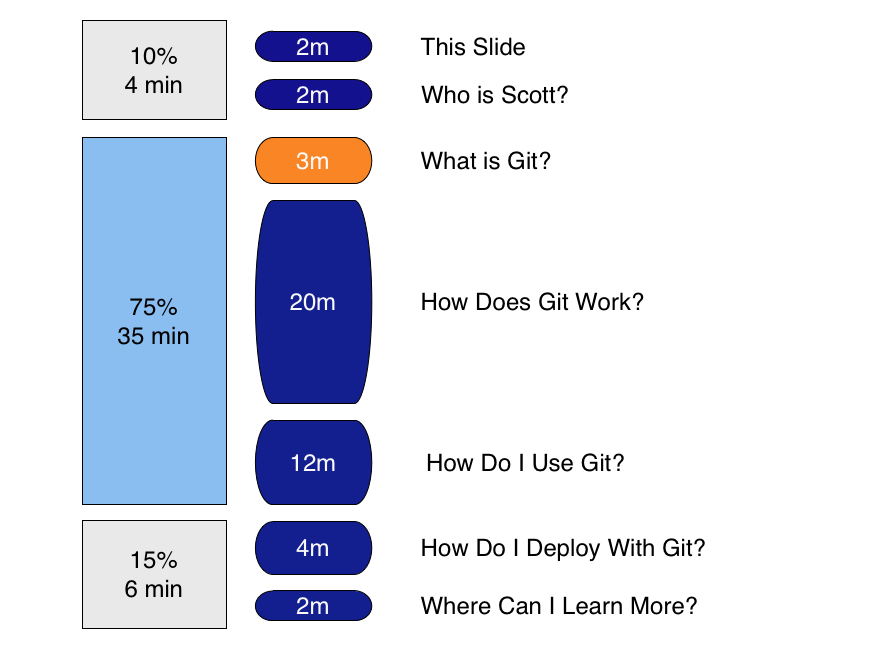
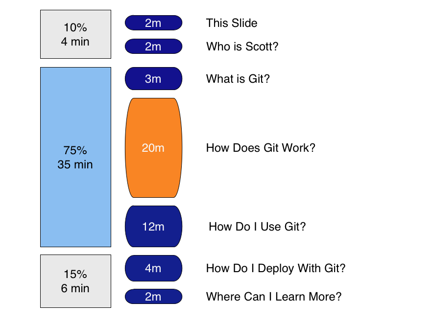
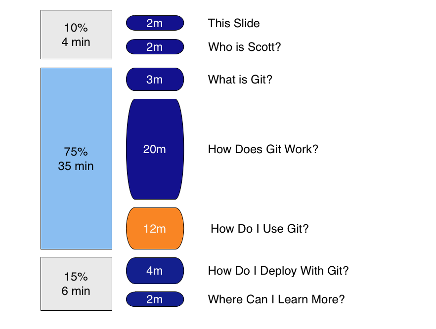
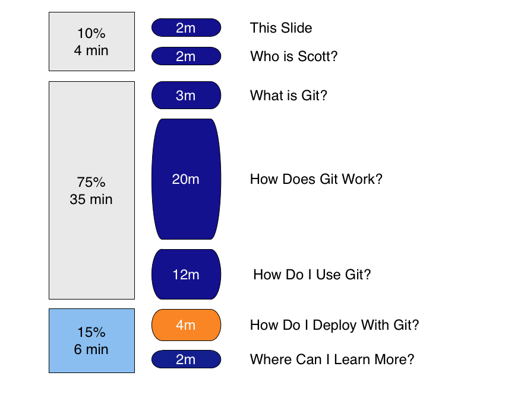
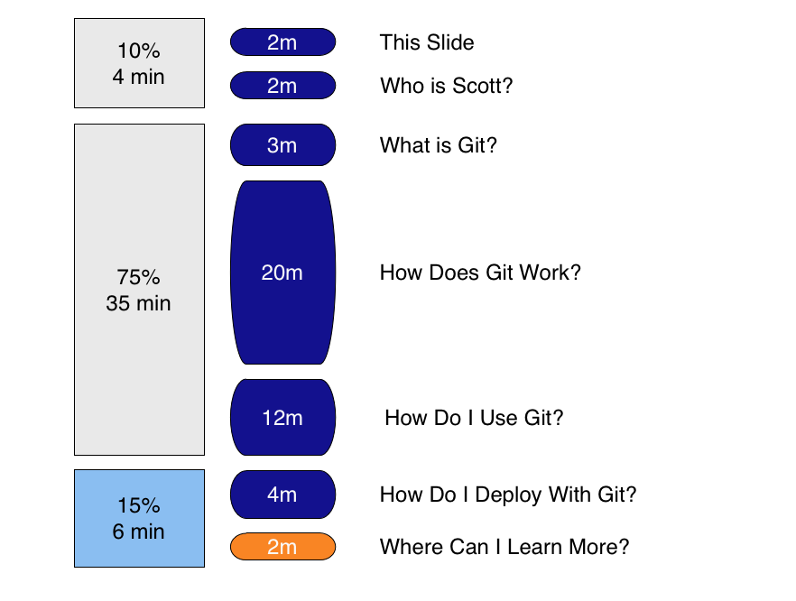

!SLIDE 
# Getting Git #
### Scott Schacon
_as seen(sort-of) at railsconf 2008_
!SLIDE center

!SLIDE center

!SLIDE center

!SLIDE center

!SLIDE center

!SLIDE center

!SLIDE center

!SLIDE center

